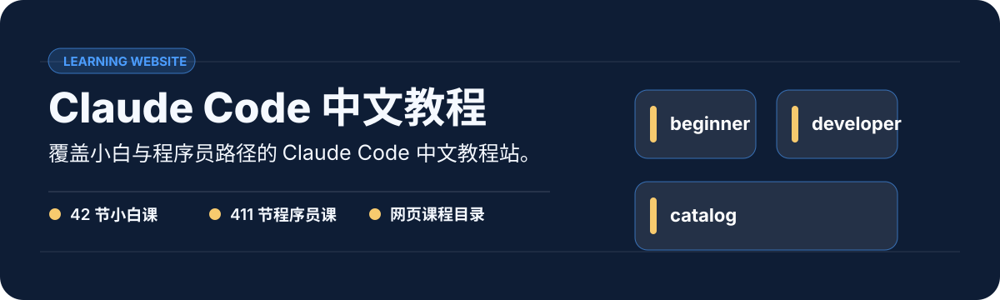

<p align="center">
  
</p>

Claude Code 中文教程网站。课程目录当前展示 42 节小白教程与 411 节程序员教程；仓库以静态课程内容和交互页面为主。

## 一眼看懂

| 价值 | 真实证据 |
| --- | --- |
| 覆盖小白与程序员路径的 Claude Code 中文教程站。 | 42 节小白课 · 411 节程序员课 · 网页课程目录 |

## 从这里开始

```text
npm install && npm run dev
```

## 内容入口

- `catalog.html`：完整课程目录。
- `easy-course/`：小白教程。
- `course/`：程序员教程。

本地命令以 `package.json` 为准。
